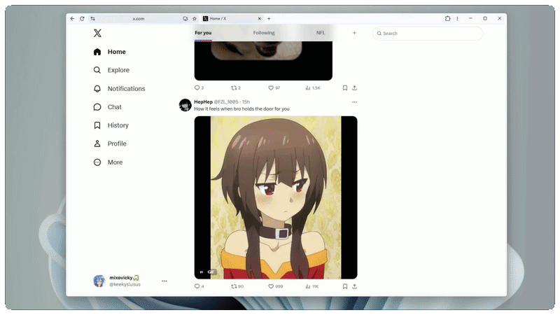
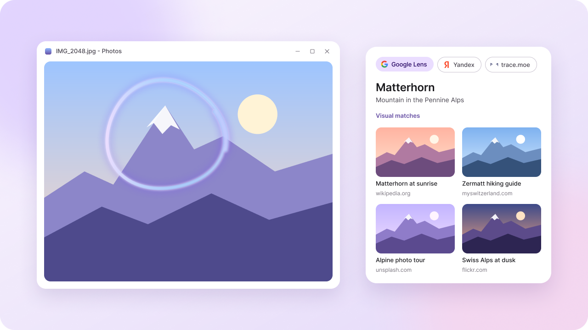
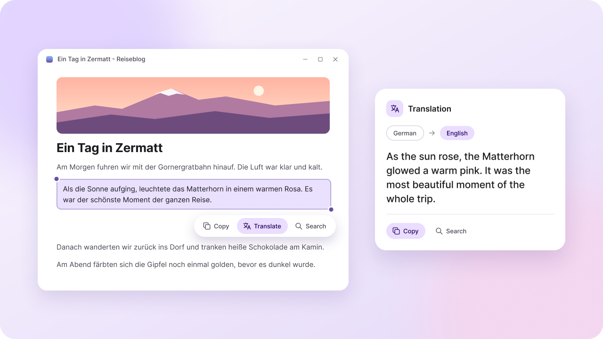
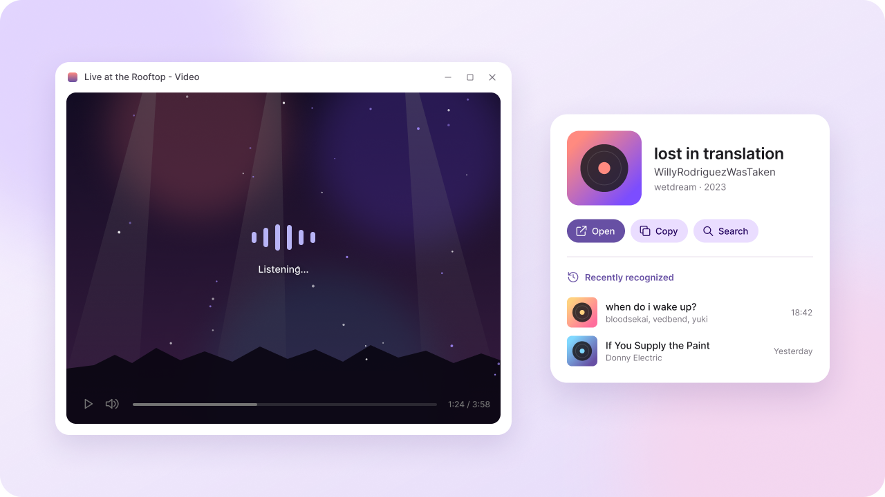
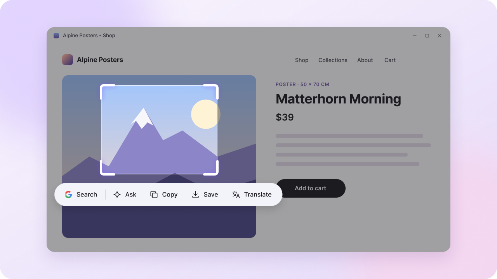
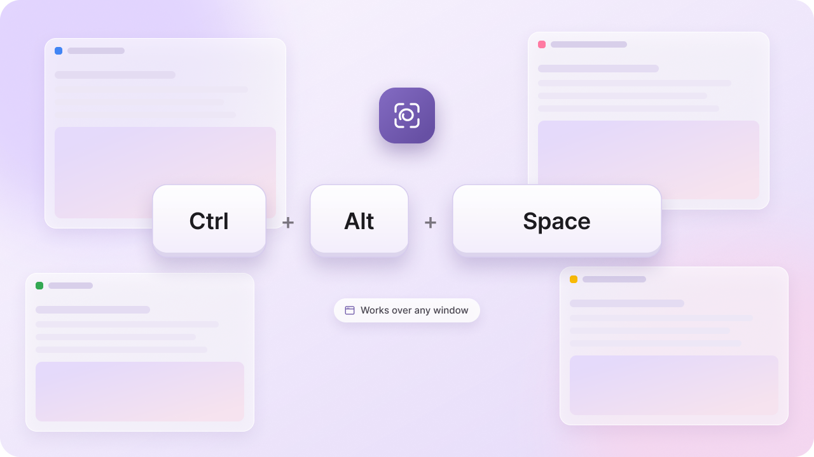

  <picture>
    <source media="(prefers-color-scheme: dark)" srcset=".github/logo_for_dark.svg">
    <source media="(prefers-color-scheme: light)" srcset=".github/logo_for_light.svg">
    
  </picture>

# CircleFlow

<h3>Circle anything on screen. Results are ready before you let go.</h3>

[Circle to Search](https://search.google/ways-to-search/circle-to-search/) from Android, now on your Windows desktop.
Just press a shortcut. No screenshots to save, no tabs to open.

## Features

### Visual Search

- Circle or select any area and search it with Google Lens, Yandex Images or trace.moe
- [trace.moe](https://trace.moe/) finds the anime, episode and timestamp of a scene
- Switch the provider right from the selection toolbar

### Text & Translation

- Select text anywhere on screen to copy it or search it with Google, Bing, [DuckDuckGo](https://duckduckgo.com/), [Kagi](https://kagi.com/), [Qwant](https://www.qwant.com/) or [Startpage](https://www.startpage.com/)
- Translate on-screen text with Google Translate
- Text recognition uses the OCR languages installed in Windows

### Music Recognition

- Recognize the song playing on your PC with Shazam
- Listens to system audio, the microphone is not used
- Copy track info or open it in Shazam
- History of recognized tracks

### Selection toolbar

- Search the selected area, ask Gemini about it, copy or save it as an image, or translate it
- Choose which actions appear in Settings

### Shortcuts

- Opens with <kbd>Ctrl</kbd>+<kbd>Alt</kbd>+<kbd>Space</kbd> by default
- Hold the <kbd>LMB</kbd> and circle to search
- Hold the <kbd>RMB</kbd> and circle to ask, copy, save or translate
- Hold <kbd>Alt</kbd> with the left button to circle over text instead of selecting it
- <kbd>Esc</kbd> closes the selection or cancels the current action

## Install

Download [`CircleFlow-win-Setup`](https://github.com/keekyslusus/CircleFlow/releases/latest) and run it. The installer is not code-signed, so Windows SmartScreen may ask you to confirm with **More info -> Run anyway**.

## Requirements

- Windows 10 v2004+, x64.
- [`Microsoft Edge WebView2 Runtime`](https://developer.microsoft.com/en-us/microsoft-edge/webview2/#download) for the built-in browser. Recent versions of Windows 10/11 already include it.

## License

GPL-3.0-or-later. See [`LICENSE`](./LICENSE), [`THIRD PARTY NOTICES`](./THIRD_PARTY_NOTICES.txt) and [`THIRD PARTY LICENSES`](./THIRD_PARTY_LICENSES).
